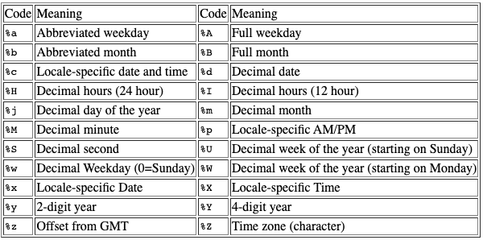

```{r,echo=FALSE, out.width="40%",fig.align="center"}
knitr::include_graphics("logoPUCP.png") 
```

Hasta el momento, hemos visto cómo traer data desde repositorios virtuales, desde portales web (con técnicas de scrapping) y diferentes funciones para limpiar inconsistencias en nuestras bases de datos. Continuando con todo lo anterior, en esta sesión repasaremos las diferentes estructuras de datos en R, enfocándonos en el formateo de fechas, horas y operaciones con ese tipo de datos.


## 1. Trabajando con fechas

Veamos cómo especificar la conversión en el formato según la manera en la cual ha sido sistematizada nuestra data:

```{r,echo=FALSE, out.width="60%",fig.align="center"}
 
```

Traigamos una base de datos con información sobre la fecha de declaración de independencia de varios países en el mundo:

```{r}
library(rvest)

linkToWebIDE="https://en.wikipedia.org/wiki/List_of_national_independence_days"
xpathToTableIDE='//*[@id="mw-content-text"]/div[1]/table[2]'
data <- read_html(linkToWebIDE)%>%html_nodes(xpath = xpathToTableIDE)%>%html_table()%>% .[[1]]

head(data)
```

```{r}
data$Date = paste(data$`Date of holiday`,data$`Year of event`)
```

Veamos cómo se encuentran las celdas donde está la información de las fechas de independencia:

```{r}
data[1,8]
```


Esta es la manera de adecuar el formato de fechas con lenguaje base de R. Utilizamos la función *as.Date* y especificamos el vector y el formato en el cuál se sistematizó la información. Siempre realizamos una verificación antes de guardar la información:

Ojo:

A veces cuando apliquemos as.Date, podemos obtener NA en vez de lo que buscamos, debido a la configuración de la fecha. En ese caso, dependiendo si trabajamos con fechas locales (en español) o en inglés, apliquemos los siguientes códigos:

Sys.setlocale("LC_TIME") # para fechas en español
Sys.setlocale("LC_TIME", "English") # para retornar a fechas en inglés

```{r}
as.Date(data$Date, format = "%d %B %Y")
data$fechas=as.Date(data$Date, format = "%d %B %Y")
str(data)
```

Una vez que hemos otorgado un formato adecuado, esto nos permite hacer operaciones con el vector, tal y como si fuera una variable con formatos a los que estamos acostumbrados. Para realizar estas operaciones, podemos utilizar la librería *lubridate*.

Vamos, además, a agregar una columna con una fecha cercana:

```{r}
data$act_date = as.Date("2023-11-02", format = "%Y-%m-%d")
head(data)
```

¿Cuantos tiempo ha pasado desde que se declaró la independencia de estos países? Con el paquete antes mencionado, podemos utilizar la función *interval*, que nos permite sacar las diferencias en años, meses, semanas e incluso días:

```{r}
library(lubridate)
data$ind_years=interval(data$fechas,data$act_date) %/% years(1)
head(data)
```

Ojo: siempre debemos tener datos completos!

Si quisieramos tener más detalle:

```{r}
data$ind_months=interval(data$fechas,data$act_date) %/% months(1)
data$ind_weeks=interval(data$fechas,data$act_date) %/% weeks(1)
data$ind_days=interval(data$fechas,data$act_date) %/% days(1)
head(data[8:14])
```

¿Qué país tiene menos tiempo como República independiente y qué país tiene más tiempo siendo independiente? Al tener un formato adecuado, podemos extraer esa información. 

```{r}
data[which.min(data$ind_years),]
data[which.max(data$ind_years),]
```

Parece que hay una inconsistencia con Japón. Para efectos prácticos del ejercicio, eliminemos el caso:

```{r}
data = data[-c(93),]
```

Ahora vemos que es Suiza:

```{r}
data[which.max(data$ind_years),]
```

Veamos otro ejemplo. ¿Qué deberíamos hacer si la información la tenemos en columnas separadas? Llamemos a otra base de datos para simular un evento así:

```{r}
dat1 <- read.csv("http://mgimond.github.io/ES218/Data/CO2.csv")
head(dat1)
```

Primero, construyamos un vector con toda la información que necesitamos. Para eso podemos utilizar la función *paste* que ya conocemos. En este caso demás, vamos a utilizar el argumento separados, para diferenciar año, mes y día con un "-":

```{r}
#paste(dat1$Year,dat1$Month, sep="-")
#paste(dat1$Year, dat1$Month, "15", sep="-")
```

Elaborado el vector, podemos darle formato. El paquete *lubridate*, adicionalmente, contiene funciones para detectar rápidamente cuando tenemos un vector que contiene años, meses y días. Esto lo hacemos con la función *ymd* si es que el orden de la información es año - mes - día. El orden de las letras cambiará según se presente el orden de las fechas.

```{r,echo=FALSE, out.width="60%",fig.align="center"}
 
```

Asignemos el día 15 como una fecha arbitraria para otorgar el formato con la función *ymd*:

```{r}
dat1$nd = ymd(paste(dat1$Year, dat1$Month, "15", sep = "-"))
str(dat1$nd)
```


## 2. Trabajando con horas, minutos y segundos:

El trabajo con horas, minutos y segundos es bastante similar al caso de las fechas. En esta tabla tenemos los códigos según la estructura de nuestros datos:

```{r,echo=FALSE, out.width="60%",fig.align="center"}
 
```

Llamemos a la data *ventanillas*, es una base de datos con los tiempos de atención que pasan en ventanilla las y los ciudadanos de una Municipalidad distrital cuando acuden a acceder a ciertos servicios. Cargamos la data:

```{r}
library(rio)
ventanillas = import("https://github.com/Alexanderbenit7/EleccionesGenerales2021/blob/master/Santa%20Anita.csv?raw=true")
head(ventanillas)
```

Veamos algo de su estructura:

```{r}
ventanillas = ventanillas[,c(1,3,6:9)]
str(ventanillas)
```


Cambiemos algunos nombres de las columnas para trabajar con mayor facilidad:

```{r}
names(ventanillas)
colnames(ventanillas) = c("VENTANILLA","TICKET","GENERACION","LLAMADA","ATENCION","FIN")
```

Otorguemos formato a uno de los vectores:

```{r}
#as.POSIXct(ventanillas$GENERACION, format = "%H:%M:%S") #Pone la fecha de hoy por defecto
ventanillas$GENER_TEST = as.POSIXct(ventanillas$GENERACION, format = "%H:%M:%S")
str(ventanillas$GENER_TEST)
```

Puede presentarse el caso eventual en el que toda la información esté concentrada en una celda; es decir, que una columna tenga no solo la hora, los minutos y segundos, sino también la fecha en la que se produjo la atención. ¿Cómo daríamos formato en casos así? Simulemos un escenario como el descrito asignando fechas aleatorias a cada ventanilla. De paso, practicamos *ifelse*:

```{r}
ventanillas$day = ifelse(ventanillas$VENTANILLA == "VENTANILLA 1", "July 5 2021",
                         ifelse(ventanillas$VENTANILLA == "VENTANILLA 2", "May 21 2021",
                         ifelse(ventanillas$VENTANILLA == "VENTANILLA 3", "June 13 2021",
                         ifelse(ventanillas$VENTANILLA == "VENTANILLA 4", "June 25 2021",
                         ifelse(ventanillas$VENTANILLA == "VENTANILLA 5", "June 2 2021",
                         ifelse(ventanillas$VENTANILLA == "VENTANILLA 6", "July 3 2021",
                         ifelse(ventanillas$VENTANILLA == "VENTANILLA 7", "May 5 2021",
                         ifelse(ventanillas$VENTANILLA == "VENTANILLA 8", "June 26 2021",
                         ifelse(ventanillas$VENTANILLA == "VENTANILLA 9", "May 13 2021",
                         ifelse(ventanillas$VENTANILLA == "VENTANILLA 10", "November 15 2021",
                         ifelse(ventanillas$VENTANILLA == "VENTANILLA 11", "June 8 2021",
                         ifelse(ventanillas$VENTANILLA == "VENTANILLA 12", "June 13 2021",
                         ifelse(ventanillas$VENTANILLA == "VENTANILLA 13", "June 13 2021",
                         ifelse(ventanillas$VENTANILLA == "VENTANILLA 14", "June 29 2021",
                         ifelse(ventanillas$VENTANILLA == "VENTANILLA 15", "November 13 2021",
                         ifelse(ventanillas$VENTANILLA == "VENTANILLA 16", "June 13 2021",
                         ifelse(ventanillas$VENTANILLA == "VENTANILLA 17", "May 22 2021",0)))))))))))))))))
```

Imaginando que tuvieramos una celda con las fechas y las horas, esta sería la manera de darle formato a todo completo:

```{r}
ventanillas$gen_fecha = paste(ventanillas$day, ventanillas$GENERACION)
ventanillas$gen_fecha=as.POSIXct(ventanillas$gen_fecha,format="%B %d %Y %H:%M:%S")
str(ventanillas$gen_fecha)
```

Otorguemos formato a las columnas que nos interesan para el análisis: observemos que va a agregar por defecto la fecha de hoy. Notemos los **:** como argumento separador entre horas, minutos y segundos. Eso varía dependendiendo de la presentación de los datos. Puede ser un / o un -.

```{r}
ventanillas$GENERACION = as.POSIXct(ventanillas$GENERACION, format ="%H:%M:%S")
ventanillas$LLAMADA = as.POSIXct(ventanillas$LLAMADA, format ="%H:%M:%S")
ventanillas$ATENCION = as.POSIXct(ventanillas$ATENCION, format ="%H:%M:%S")
ventanillas$FIN = as.POSIXct(ventanillas$FIN, format ="%H:%M:%S")
str(ventanillas)
```

Veamos la duración total de la atención en cada ventanilla. Para eso podemos utilizar la función **diff**:

```{r}
ventanillas$diff = difftime(ventanillas$FIN,ventanillas$GENERACION, units="min") #secs si fueran segundos
ventanillas$secs = difftime(ventanillas$FIN,ventanillas$GENERACION, units="secs")
```

Al tener ya esa información, podemos realizar algunos análisis. Por ejemplo, ¿cuál fue el tiempo record de atención? ¿Qué ventanilla tiene el record?

```{r}
min(ventanillas$diff)
ventanillas[which.min(ventanillas$diff),]
```

¿Cuáles fueron los tardones?

```{r}
max(ventanillas$diff)
ventanillas[which.max(ventanillas$diff),]
```

En tanto este es un vector numérico, ya podemos hacer algunas operaciones. Veamos la distribución del tiempo de atención:

```{r}
ventanillas$duracion=as.numeric(ventanillas$diff)
hist(ventanillas$duracion)
```

Hay tickets que duran más en promedio? Veamos:

```{r}
table(ventanillas$TICKET)
```

Son varios. Saquemos el promedio de atención por ticket:

```{r}
library(dplyr)
TICKETS = ventanillas %>% group_by(TICKET) %>%
  summarize(DURACION = mean(duracion, na.rm = T))
```

¿Cuál tarda más? ¿Cuál dura menos?

```{r}
TICKETS[which.max(TICKETS$DURACION),]
TICKETS[which.min(TICKETS$DURACION),]
```

Grafiquemos solo los que son trámites administrativos (DJ):

```{r}
ADMIN = filter(TICKETS, grepl("DJ", TICKET))
ADMIN = ADMIN[complete.cases(ADMIN$DURACION),]
```

Utilicemos los códigos que ya conocemos para graficar:

```{r echo=FALSE,message=FALSE,warning=FALSE,eval=TRUE,fig.show='hold',fig.width=10,fig.height=8, fig.align="center"}
library(ggplot2)
ggplot(ADMIN, aes(x=reorder(TICKET,DURACION), y=DURACION), fill = select) + 
  geom_bar(stat = "identity") + 
  coord_flip() + 
  labs(title = "Duración promedio",
       x = " ",
       y = "Minutos") + 
  geom_hline(yintercept = mean(TICKETS$DURACION) ,linetype="dashed", color="blue",size=1)+ 
  ylim(0, 90) + 
  geom_text(aes(label=paste0(round(DURACION,0)," mins")), vjust=0.5, hjust = 1.2,color="white", size=3)
```

¿Y si la Municipalidad los contratara para hacer un estudio de los días con mayor y menor actividad? Podríamos hacer algo así:

Carguemos la original:

```{r}
ventanillas = import("https://github.com/Alexanderbenit7/EleccionesGenerales2021/blob/master/Santa%20Anita.csv?raw=true")
ventanillas = ventanillas[,c(1,3,6:9,10)]
colnames(ventanillas) = c("VENTANILLA","TICKET","GENERACION","LLAMADA","ATENCION","FIN","FECHA")
```

```{r}
ventanillas$FECHA = substr(ventanillas$FECHA,1,8) #está la fecha de la atención
```

```{r}
ventanillas$ATEN = paste(ventanillas$FECHA, ventanillas$GENERACION)
ventanillas$ATEN= as.POSIXct(ventanillas$ATEN,format="%d/%m/%y %H:%M:%S")
```

```{r}
ventanillas$day=weekdays(ventanillas$ATEN, abbreviate = F) #nos quedamos con el día
ventanillas$hour = substr(ventanillas$ATEN,12,13) #nos quedamos con la hora
```

Número de atenciones por día y hora:

```{r}
tiempos_Fecha = ventanillas %>% 
  group_by(day, hour) %>% 
  summarise(ATENCIONES = n ())
```

```{r}
dow_format <- c("Monday","Tuesday","Wednesday","Thursday","Friday","Saturday")
tiempos_Fecha$day <- factor(tiempos_Fecha$day, level = rev(dow_format))
```

```{r echo=FALSE,message=FALSE,warning=FALSE,eval=TRUE,fig.show='hold',fig.width=8,fig.height=6, fig.align="center"}
ggplot(tiempos_Fecha, aes(x = hour, y = day, fill = ATENCIONES)) +
  geom_tile() +
  
  theme(axis.text.x = element_text(angle = 90, vjust = 0.6), legend.title = element_blank(), 
        legend.position="top", legend.direction="horizontal", legend.key.width=unit(2, "cm"),
        legend.key.height=unit(0.25, "cm")) +
  
  labs(x = "Hora de atencion", y = "Dia de la semana", title = "Numero de atenciones")+ 
  
  scale_fill_gradient(low = "white", high = "#27AE60") +
  
  theme(panel.background=element_rect(fill = "white", colour = "black"))+ 
  
  theme(plot.title = element_text(hjust = 0.5))
```


# 3. Agrupación y construcción de intervalos:

Agrupar datos y construir intervalos desde los datos son dos conceptos que se encuntran relacionados. En lo que respecta al primero, lo que hacemos es transformar una variable numérica en una categórica, asignando cortes a los datos. Es un intercambio, en el sentido que perdemos precisión y ganamos "claridad" al momento de presentar la información. 

A lo largo del curso ya hemos visto formas de agrupar nuestros datos, principalmente utilizando la función *ifelse*. Utilicemos la base de datos del artículo "Pavimentando con Votos" para ejemplificar diferentes formas de agrupar nuestros datos:

```{r}
data = import("https://github.com/PoliticayGobiernoPUCP/estadistica_anapol2/blob/master/DATA/pavimentando%20con%20votos.sav?raw=true")
```

Hagamos algunos cortes a la variable con el porcentaje de votos de la oposición (pctopo) de la base de datos: 

```{r}
#Veamos cómo está formateada:
str(data$pctopo)
summary(data$pctopo)
hist(data$pctopo)
```

Empecemos diferenciando aquellos Municipios en los que la oposición obtuvo más de la mitad del % total de los votos. La forma clásica de hacerlo es utilizando *ifelse* con lenguaje base:

```{r}
data$cortes_pctopo = factor(ifelse(data$pctopo>50,1,0))
data$cortes_pctopo = factor(data$cortes_pctopo, levels = c(0:1), labels = c("La mitad o menos","Más de la mitad")) #Asignando nombres a las categorías
```

```{r}
table(data$cortes_pctopo)
barplot(table(data$cortes_pctopo))
```

También hemos visto maneras de implementar la función *ifelse* a la librería *dplyr* y la función *mutate* para crear una variable nueva:

```{r}
library(dplyr)
data = mutate(data, cortes_pctopo_2 = ifelse(pctopo>50,1,0)) 
data$cortes_pctopo_2 = factor(data$cortes_pctopo_2, levels = c(0:1), labels = c("La mitad o menos","Más de la mitad"))
```

```{r}
table(data$cortes_pctopo_2)
```

Ahora, al agrupar nuestra data, podemos crear diferentes condicionales para realizar el agrupamiento. Por ejemplo, qué sucede si queremos crear grupos para dividir la data entre los Municipios tomando en cuenta el % de votos de la oposición y si es que había o no prioridad técnica (priorizado):

0 --> Municipio no priorizado
1 --> Municipio priorizado

```{r}
data$cat_dob = ifelse(data$pctopo > 50 & data$priorizado == 1, 1, #Ojo que son dos condiciones, por eso el &
                      ifelse(data$pctopo > 50 & data$priorizado == 0,2,
                             ifelse(data$pctopo <= 50 & data$priorizado == 1,3,
                                    ifelse(data$pctopo <= 50 & data$priorizado == 0,4,0))))
```

```{r}
data$cat_dob = factor(data$cat_dob, levels = c(1:4), labels = c("Más del 50% y priorizado",
                                                                "Más del 50% y no priorizado",
                                                                "La mitad o menos y priorizado",
                                                                "La mitad o menos y no priorizado"))
```

```{r}
table(data$cat_dob)
barplot(table(data$cat_dob))
```

Podemos seguir agregando más y más condiciones si ya entendimos la lógica del código. Es bueno, además, darle una mirada a los operadores en R, que se utilizan mucho en los condicionales: <https://www.datamentor.io/r-programming/operator/>

Si bien hacer esto es relativamente "sencillo", se puede volver más complejo cuando se asignan cortes más arbitrarios. ¿Qué es alto, medio, bajo y muy bajo? ¿Qué es muy bueno, bueno, malo y muy malo? Esto siempre puede ser contestado, ya que, si lo trasladamos al ámbito de las ciencias sociales, el aumento de una décima podría implicar el traslado de un país de un régimen híbrido a uno democrático. En suma, las consecuencias de esa decisión no son menores. Construir las categorías debe realizarse a partir de un buen balance entre la observación de los datos y la teoría.

En lo relacionado a la construcción de intervalos, estos se elaboran a partir de los datos. Para elaborarlos, necesitamos conocer el valor mínimo y máximo teórico, y decidir dónde cortar el rango. En R, podemos utilizar la función *cut*, y asignarle un vector de cortes que incluya al menor y al mayor valor. Ahora trabajemos con la variable de necesidades básicas insatisfechas (nbi):

```{r}
str(data$nbi)
summary(data$nbi)
```

```{r}
breaks_nbi = c(0,20,40,60,80,100)
labels_nbi = c("Muy insatisfechas","Insatisfechas","Medianamente satisfechas","Satisfechas","Altamente satisfechas")
data$int_nbi = cut(data$nbi,
                   breaks = breaks_nbi,
                   labels = labels_nbi,
                   oredered_result = T)
```

```{r}
table(data$int_nbi)
barplot(table(data$int_nbi))
```

Pero podríamos simplemente especificar los cortes y dejar que se asignen los casos en función a la distribución de los datos:

```{r}
breaks_nbi = 5
labels_nbi = c("Muy insatisfechas","Insatisfechas","Medianamente satisfechas","Satisfechas","Altamente satisfechas")
data$int_nbi = cut(data$nbi,
                   breaks = breaks_nbi,
                   labels = labels_nbi,
                   oredered_result = T)
```

```{r}
table(data$int_nbi)
barplot(table(data$int_nbi))
```

# 4. Agregando datos:

Muchas veces, la data con la que nos encontramos se encuentra bastante más desagregada de lo que en realidad necesitamos analizar. En esos casos, lo que nos interesa llevar a cabo es *agregar* los datos, de tal forma que trabajemos con un menor número de unidades de análisis. Veamos un ejemplo:

Carguemos una base de datos con los resultados de las EG 2016 en segunda vuelta a nivel distrital. La base, además, cuenta con variables como el índice de desarrollo humano, la población, el PBI per capita, entre otras:

```{r}
data_idh = import("https://github.com/PoliticayGobiernoPUCP/estadistica_anapol2/raw/master/DATA/idh_elec.csv")
```

Hay diferentes formas de agregar datos, y va a depender mucho de los objetivos de nuestro análisis y la naturaleza de nuestras variables. Por ejemplo, ¿cómo podríamos proceder si quisieramos el IDH a nivel de provincias y no de distritos? Una forma de hacerlo es con la función *tapply*:

```{r}
prov_idh = tapply(data_idh$idh, data_idh$prov, mean, na.rm = T)
prov_idh = as.data.frame(prov_idh)
prov_idh
```

Y si lo queremos a nivel de regiones:

```{r}
reg_idh = tapply(data_idh$idh, data_idh$depa, mean, na.rm = T)
reg_idh = as.data.frame(reg_idh)
reg_idh
```

Podemos hacerlo con dos variables a la vez: veamos promedios agregados de IDH y PBI per capita:

```{r,echo=FALSE, out.width="40%",fig.align="center"}
 
```

```{r}
reg_idh = tapply(data_idh$idh, data_idh$depa, mean, na.rm = T)
reg_pbi = tapply(data_idh$percapitaf, data_idh$depa, mean, na.rm = T)
group = as.data.frame(cbind(reg_idh, reg_pbi)) #Cuidado cuando hay casos perdidos y usan cbind!!
group
```

Y con eso, ya podemos mirar nuestros datos a nivel regional. Repasemos Estadística 1:

```{r}
plot(group$reg_idh, group$reg_pbi)
```

Hay, sin embargo, varias formas de agregar nuestros datos; más aún cuando lo hacemos sobre la media. Veamos la función *aggregate*:

```{r}
aggregate(data_idh[,c(8)], by = list(data_idh[,4]), mean) #idh
aggregate(data_idh[,c(8,12)], by = list(data_idh[,4]), mean) #idh y pbi per capita
```

Lo mismo podemos hacer utilizando las funciones de *dplyr*:

```{r}
data_idh %>%
  group_by(depa) %>%
  summarize(mean_idh = mean(idh, na.rm = TRUE))
```

Y aquí podemos solicitar más medidas para agregar nuestra data:

```{r}
data_idh %>%
  group_by(depa) %>%
  summarize(mean_idh = mean(idh, na.rm = TRUE), #media
            min_idh_reg = min(idh, na.rm = TRUE), #idh mínimo de la región
            max_idh_reg = max(idh, na.rm = TRUE), #idh máximo de la región
            median_idh = median(idh, na.rm = TRUE)) #mediana
```

Ahora, esta base nos da información sobre la cantidad de votos por PPK y KF en cada distrito. Si nos solicitaran explorar visualmente la asociación entre el PBI per capita y el porcentaje de votos por PPK a nivel de departamentos, ¿cuál sería la forma de agregar los datos? Aquí el promedio no es útil. Necesitamos sumar los valores de cada caso. *Dplyr* es muy útil para ello:

```{r}
pob_reg=data_idh %>%
  group_by(depa) %>%
  summarise(pob_reg = sum(pobla, na.rm = T)) 
pob_reg
```

```{r}
ppk_reg=data_idh %>%
  group_by(depa) %>%
  summarise(ppk_reg = sum(PPK, na.rm = T)) #para los conteos
ppk_reg
```

Ahora necesitamos juntar la información. El código que hemos venido utilizando es *cbind* para unir ambos objetos. Sin embargo, hay una función denominada *merge*, que permite juntar dos objetos en base a un vector que sirve como variable de identificación de casos. Veremos más detalles de la función en las siguientes clases pero, por ahora, veamos su forma más básica:

```{r}
total = merge(pob_reg, ppk_reg, by = "depa")
```

Sacamos la proporción de voto por PPK:

```{r}
total$prop_ppk = (total$ppk_reg/total$pob_reg)*100
```

Ahora agregamos el IDH por departamento:

```{r}
idh_reg = data_idh %>%
  group_by(depa) %>%
  summarize(mean_idh = mean(idh, na.rm = TRUE))
```

```{r}
total = merge(total,idh_reg, by = "depa")
```

Exploremos visualmente la asociación entre IDH y proporción de voto por PPK: ¿Qué opinan?

```{r}
plot(total$prop_ppk, total$mean_idh)
```

Finalmente, otra forma súper útil de agregar datos, es cuando **cada caso de nuestra base de datos es de interés**. Es decir, cuando queremos agruparlos en función al número de ocurrencias. Por ejemplo, si queremos mostrar el número de distritos de cada región, podría utilizar esto:

```{r}
dis_reg = data_idh %>%
  group_by(depa) %>%
  summarise(count = n())

dis_reg
sum(dis_reg$count) #verificamos
```


---

Exporte la data de este link: https://github.com/appliedepi/epirhandbook/blob/master/inst/extdata/linelist_cleaned.xlsx

1. Otorgue un formato adecuado para las variables que tienen fechas. Encuentre la diferencia en días entre la fecha de infección del paciente (date_infection) y la fecha de hospitalización (date_hospitalisation). Describa cuáles fueron los síntomas del paciente o pacientes con menor y mayor diferencia de tiempo entre ambas fechas.

2. Cree un vector que marque las 18:00 y encuentre la diferencia en minutos y segundos con respecto a la variable *time_admission*.

```{r}
data=import("https://github.com/appliedepi/epirhandbook/blob/master/inst/extdata/linelist_cleaned.xlsx?raw=true")
```


