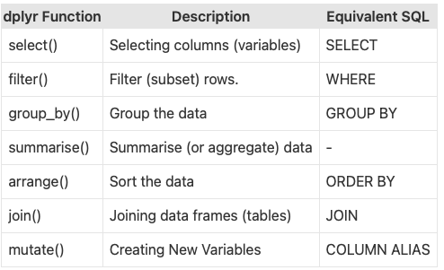
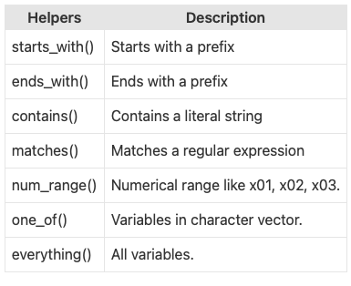

```{r,echo=FALSE, out.width="30%",fig.align="center"}
knitr::include_graphics("logoPUCP.png") 
```

En las sesiones previas, hemos revisado diferentes estrategias de extracción y limpieza de datos. Hoy trabajaremos algunas funciones de manipulación de bases de datos con la librería *dplyr* y aplicaremos todo lo aprendido.

### 1. ¿Qué es dplyr?

Dplyr es un potente paquete de R para manipular, limpiar y resumir datos no estructurados. En resumen, hace que la exploración de datos y la manipulación de datos sea fácil y rápida en R.

¿Qué tiene de especial dplyr?

El paquete "dplyr" comprende muchas funciones que realizan las operaciones de manipulación de datos más utilizadas, como aplicar filtros, seleccionar columnas específicas, ordenar datos, añadir o eliminar columnas y agregar datos. Otra de las ventajas más importantes de este paquete es que es muy fácil aprender y utilizar las funciones de dplyr. También es fácil recordar estas funciones. Por ejemplo, filter() se utiliza para filtrar filas.

```{r,echo=FALSE, out.width="30%",fig.align="center"}
 
```

Empezamos!

```{r}
library(rio)
library(dplyr)
```

```{r}
mydata = import("https://raw.githubusercontent.com/deepanshu88/data/master/sampledata.csv")
```

### 2. Funciones básicas

La función *sample_n* selecciona filas aleatorias de un marco de datos (o tabla). El segundo parámetro de la función indica a R el número de filas que debe seleccionar. Pidamos cinco casos de forma aleatoria:

```{r}
sample_n(mydata,5)
```

Con la función *sample_frac* solicitamos un porcentaje de casos del total de la data:

```{r}
sample_frac(mydata,0.1)
```

Con la función *discinct* eliminamos casos repetidos. Podemos hacerlo en función a una variable. Tomemos como ejemplo la variable Index. *.keep_all* es necesario para quedarnos con todas las columnas.

```{r}
x2 = distinct(mydata, Index, .keep_all= TRUE)
table(mydata$Index)
table(x2$Index)
```

Ya conocemos la función *select*:

```{r}
mydata2 = select(mydata, Index, State:Y2008) #Los : para indicar un rango de columnas.
```

Con el signo negativo dropeamos variables:

```{r}
mydata = select(mydata, -Index, -State)
```

Con *start_with* nos quedamos con las variables que empiezan con alguna letra en específico:

```{r}
mydata3 = select(mydata, starts_with("Y"))
#mydata33 = select(mydata, -starts_with("Y")) Así si quisieramos dropear las que empiezan con Y.
```

Otras funciones para seleccionar variables:

```{r,echo=FALSE, out.width="30%",fig.align="center"}
 
```

Ejemplo rapido:

```{r}
#Nos quedamos con las que acaban en 2:
mydata3 = select(mydata, ends_with("2"))

#O que contengan un elemento en específico:
mydata4 = select(mydata, contains("1"))
```

Cambiando nombres de variables:

```{r}
mydata = import("https://raw.githubusercontent.com/deepanshu88/data/master/sampledata.csv")
names(mydata)
```

```{r}
mydata6 = mydata
colnames(mydata6)[1] ="Index1"
#colnames(mydata6) = c("Nombres de cada vector")
names(mydata6)
```

Con *filter* filtramos la base:

```{r}
mydata7 = filter(mydata, Index == "A")
head(mydata7)
```

El operador *%in%* se puede utilizar para seleccionar múltiples elementos. Aquí le estamos diciendo a R que seleccione filas 'A' y 'C' en la columna 'Índice'.

```{r}
mydata7 = filter(mydata6, Index1 %in% c("A", "C"))
head(mydata7)
```

Otra alternativa:

```{r}
mydata7 = filter(mydata6, Index1  == "A" | Index1 == "C") #Recordamos EAP 1 y los operadores lógicos
head(mydata7)
```

Podemos aplicar más condiciones en la misma línea de código. Queremos a los casos A y C en la variable Index **Y** a los casos mayores a 1300000 en el año 2002:

```{r}
mydata8 = filter(mydata6, Index1 %in% c("A", "C") & Y2002 >= 1300000 )
head(mydata8) #Veamo:
```

Ahora queremos a los casos A y C en la variable Index **O** los casos mayores a 1300000 en el año 2002:

```{r}
mydata9 = filter(mydata6, Index1 %in% c("A", "C") | Y2002 >= 1300000)
tail(mydata9) #Nótese que hay casos que no son ni A ni C!!
```

Y cuando NO queremos algunos casos de la variable:

```{r}
mydata10 = filter(mydata6, !Index1 %in% c("A", "C"))
head(mydata10)
```

Vamos a utilizar la función de filtro con la función *grepl* para buscar a todos aquellos países que tengan "Ar" en el nombre:

```{r}
mydata10 = filter(mydata6, grepl("Ar", State))
head(mydata10)
```

Ahora podemos hacer cálculos con los vectores con la función *summarise*:

```{r}
summarise(mydata, Y2015_mean = mean(Y2015),
                  Y2015_med=median(Y2015))
```

Con *summarise_at* podemos solicitar varias medidas de tendencia central para varias variables así:

```{r}
summarise_at(mydata, vars(Y2005, Y2006), funs(n(), mean, median))
```

Otra forma:

```{r}
summarise_at(mydata, vars(Y2005, Y2006), list(~n(), ~mean(.), ~median(.)))
```

### 3. Pipe operator %\>%

El operador pipe se utiliza en *dplyr* prestado de la librería *magrittr* y permite concatenar funciones en una línea de código:

Por ejemplo, nos vamos a quedar solo con dos variables y, sobre esa selección, sacamos una muestra de diez casos:

```{r}
dt = mydata %>% select(Index, State) %>% sample_n(10)
head(dt)
```

Así podemos manipular de muchas formas nuestra base original sin moverla realmente. Otro ejemplo:

```{r}
dt1 = mydata %>%
  select(Index,Y2002,Y2008,Y2010) %>%
  group_by(Index) %>%
  summarise_at(vars(Y2002,Y2008,Y2010), funs(n(), mean, median)) %>%
  filter(Y2002_mean >= 1501744)

#Y así hasta el infinito

head(dt1)
```

Función *do()*: Solicitamos algo a la data

```{r}
t = mydata %>% filter(Index %in% c("A", "C","I")) 
head(t)
```

Le pedimos que nos dé los dos primeros casos de cada grupo:

```{r}
t = mydata %>% filter(Index %in% c("A", "C","I")) %>% group_by(Index) %>%
  do(head( . , 2))
head(t)
```

Lo interesante es que podemos pedirle que se quede no solo con los primeros casos en términos de posición, sino también con el tercer caso más alto de la variable, por ejemplo:

```{r}
t = mydata %>% select(Index, Y2015) %>% #Selecciona variables
  filter(Index %in% c("A", "C","I")) %>% #Filtra por categorías
  group_by(Index) %>% #Agrupa
  do(arrange(.,desc(Y2015))) %>%  slice(3) #Ordena y se queda con el tercer valor más alto

head(t)
```

Otro ejemplo de concatenación de funciones:

```{r}
t = mydata %>%
  group_by(Index)%>%
  summarise(Mean_2014 = mean(Y2014, na.rm=TRUE),
            Mean_2015 = mean(Y2015, na.rm=TRUE)) %>%
  arrange(desc(Mean_2015))

head(t)
```

### 4. Reshape

Otro conjunto de funciones están en la librería *reshape*. La data con la que estamos trabajando está limpia, pero no necesariamente ordenada. Es decir, muchas veces, algunos gráficos requieren de cierto tipo de estructura de datos. Si quisieramos hacer un gráfico de líneas, en la que cada línea es un año, este tipo de esturctura de datos no nos ayudaría. Reshape nos puede ayudar con esto:

Esta es nuestra data:

```{r}
head(mydata)
```

```{r}
library(reshape)
rdata <- melt(mydata, id=c("Index","State"))
head(rdata)
```

Podemos renombrar las columnas:

```{r}
colnames(rdata)[3] = "Year"
```

Esa Y al inicio de cada año puede ser fastidiosa. Felizmente podemos eliminarla con *subtr*:

```{r}
rdata$Year = substr(rdata$Year,2,8)
head(rdata)
```

Con esto ya podríamos graficar. Agrupemos por índice:

```{r}
rdata = rdata %>%
  group_by(Index,Year) %>%
  summarise(MEDIA = mean(value, na.rm = T)) %>%
  filter(Index %in% c("A","C"))

rdata$Year = as.numeric(rdata$Year)
```

```{r} 
library(ggplot2)
ggplot(rdata, aes(x = Year, y = MEDIA, colour = Index)) +
  geom_line()
```

### 5. Toupper:

Cambiemos las cosas a mayúsculas:

```{r}
a <- "No se duerman"
a
```

```{r}
toupper(a)
```

```{r}
mydata$State1 = toupper(mydata$State)
table(mydata$State1)
```

Para minúsculas:

```{r}
mydata$State2 = tolower(mydata$State1)
table(mydata$State2)
```

Si queremos bajar a minúsculas desde el segundo elemento de la línea de texto:

```{r}
mydata$State3=stringr::str_to_title(mydata$State1)
table(mydata$State3)
```

### 6. Ejercicio de limpieza final:

-   Data de ERM a nivel distrital
-   Nos quedamos con el ausentismo
-   Con el ganador y con el segundo puesto
-   Agregamos UBIGEOS
-   Cruzamos UBIGEOS de INEI con RENIEC
-   Vamos a sacar índice de competitividad: diferencia entre el primer y el segundo
-   Cruzamos con variables de CEPLAN

```{r}
ERM = import("https://github.com/Alexanderbenit7/EAP2_2023-2/raw/main/data/DISTRITAL.xlsx")
UBI_JNE = import("https://github.com/Alexanderbenit7/EAP2_2023-2/raw/main/data/UBI.xlsx")
EQUIV = import("https://github.com/Alexanderbenit7/EAP2_2023-2/raw/main/data/Equivalencias.xlsx")
CEPLAN = import("https://github.com/Alexanderbenit7/EAP2_2023-2/raw/main/data/ceplan.xlsx")
```

#### 6.1. Ausentismo a nivel distrital:

Sacamos el ausentismo a nivel distrital:

```{r}
AUSEN = select(ERM, c(1:3,5,12))
AUSEN$AUSENTISMO = 1-AUSEN$`% Participación`
```

Preparemos los ubigeos de RENIEC y agregamos:

```{r}
UBI_JNE$UNIF = paste0(UBI_JNE$REGION,UBI_JNE$PROVINCIA,UBI_JNE$DISTRITO)
UBI_JNE = select(UBI_JNE, c(1,12))
```

Agregamos vector de unificación en la base de ausentismo:

```{r}
AUSEN$UNIF = paste0(AUSEN$Region, AUSEN$Provincia, AUSEN$Distrito)
AUSEN = select(AUSEN, c(1:3,5:7))
```

Juntamos información:

```{r}
AUSEN = merge(AUSEN, UBI_JNE, by = "UNIF", all.x = T)
AUSEN = select(AUSEN, -c(1))
```

```{r}
#Lo que perdimos:
sum(is.na(AUSEN$UBIGEO))
perdidos = AUSEN[is.na(AUSEN$UBIGEO),]
table(perdidos$Distrito)
```

#### 6.2. Ganador del Municipio local:

```{r}
ERM= ERM[complete.cases(ERM$`Tipo Organización Política`),] #Para solo quedarnos con org. políticas
```

Se gana con mayoría simple, así que nos quedamos con el valor más alto:

```{r}
GANADOR = ERM %>%
  filter(YEAR == 2018) %>%
  group_by(Region,Provincia,Distrito) %>%
  summarise(Ganador = max(`% Votos`, na.rm = T))
```

Agregamos UBIGEO:

```{r}
GANADOR$UNIF = paste0(GANADOR$Region,GANADOR$Provincia, GANADOR$Distrito)
GANADOR = merge(GANADOR, UBI_JNE, by = "UNIF", all.x = T)
GANADOR = select(GANADOR, c(5:6))
```

#### 6.2. El que se queda en segundo puesto:

La función *do()* es crucial determinante:

```{r}
SEGUNDO = ERM %>%
  filter(YEAR == 2018) %>%
  group_by(Region,Provincia,Distrito) %>%
   do(arrange(.,desc(`% Votos`))) %>%  slice(2)
```

Seleccionamos las variables de interés:

```{r}
SEGUNDO$UNIF = paste0(SEGUNDO$Region, SEGUNDO$Provincia, SEGUNDO$Distrito)
SEGUNDO = merge(SEGUNDO, UBI_JNE, by = "UNIF", all.x = T)
SEGUNDO= select(SEGUNDO, c(12,14))
colnames(SEGUNDO) = c("Segundo","UBIGEO")
```

#### 6.3. Variables de CEPLAN:

```{r, echo=FALSE, warning=FALSE}
#Indicadores de CEPLAN: IDH, y % de pobreza y pobreza extrema
CEPLAN = CEPLAN[,c(1,2,39,40,42)]
colnames(CEPLAN) = c("marca","UBIGEO","IDH_2019","%POBREZA","%POBREZAEXT")
CEPLAN = CEPLAN[CEPLAN$marca == "Distrito",]
CEPLAN = CEPLAN[complete.cases(CEPLAN$UBIGEO),]
CEPLAN = CEPLAN[,-c(1)]
CEPLAN[,c(2:4)]=lapply(CEPLAN[,c(2:4)],as.numeric)
```

#### 6.4. Juntamos data política:

```{r}
AUSEN = filter(AUSEN,YEAR == 2018) 
AUSEN=AUSEN[!duplicated(AUSEN), ]
```

```{r}
FINAL_DATA = merge(AUSEN, GANADOR, by = "UBIGEO") 
FINAL_DATA = merge(FINAL_DATA, SEGUNDO, by = "UBIGEO")
FINAL_DATA = FINAL_DATA[complete.cases(FINAL_DATA$UBIGEO),]
```

Juntamos UBIGEO INEI:

```{r}
EQUIV = select(EQUIV, c(1,2))
```

```{r}
FINAL_DATA = merge(FINAL_DATA, EQUIV, by.x = "UBIGEO", by.y = "UBIGEO_RENIEC")
```

Agregamos data de CEPLAN:

```{r}
FINAL_DATA = merge(FINAL_DATA, CEPLAN, by.x = "UBIGEO_INEI", by.y = "UBIGEO")
```

Agregamos el nivel de competitividad:

```{r}
FINAL_DATA$COMPETITIVIDAD = FINAL_DATA$Ganador-FINAL_DATA$Segundo
FINAL_DATA$REG=stringr::str_to_title(FINAL_DATA$Region)
FINAL_DATA$PROV=stringr::str_to_title(FINAL_DATA$Provincia)
FINAL_DATA$DIST=stringr::str_to_title(FINAL_DATA$Distrito)
```

Data final:

```{r}
FINAL_DATA = select(FINAL_DATA, c(1,14:16,7,10:13)) %>%
  filter(COMPETITIVIDAD>=0)
head(FINAL_DATA)
```

Y ya para irnos:

```{r}
sub_data = select(FINAL_DATA, c(5:9))
```

```{r}
library(PerformanceAnalytics)
chart.Correlation(sub_data) 
```
